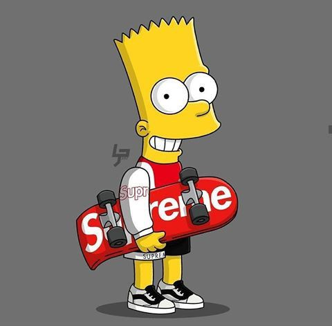

# kukysk.github.io
<!DOCTYPE html>
<html>
<head>
<title>Page Title</title>
</head>
<body>

<table style="width:30%" border="1" bgcolor="#D3D3D3">

  <tr>
    <td style="width:50%"><h4>Fotka</h4></td>
    <th colspan="2">Osobni udaje</th>
  </tr>

<tr>
    <th height="20px" rowspan="3"></th>
    <td><h4>Meno:</h4></td>
    </td>
	<td>Bart</td>
</tr>
<tr>
    <td><h4>Povoláni:</h4></td>
	<td>Zapalkár</td>
  </tr>
  <tr>
    <td><h4>Misto pusobnosti:<h4></td>
	<td height="100px"td align="center">Springfield:</td>
  </tr>

  <tr>
  	<td colspan="3">Citat::</td>
  </tr>

  <tr>
   
    <tr>
        <td colspan="3" height="80px" style="width: 259px; vertical-align:top">
            Neděle je den, kdy se dělají domácí úkoly, což je jedna z hlavních příčin toho, proč nenávidím neděli
        </td>
    </tr>

  </tr>

  <tr>
  	<td colspan="3">Rodina:</td>
  </tr>

  <tr>

   <td colspan="3" height="200px" style="width: 259px; vertical-align:top">
       
<ol type="I">
<li>Simpsonovci</li>  
</ol>
<ol>
<li>Mama <a href="url"> Marge</a> </li>
<li>Otec <a href="url"> Homer</a></li>
</ol>
<ol type="a">
<li>Staršia sestra <a href="url">Lisa</a></li>
<li>Mladšia sestra <a href="url">Maggy</a></li>
</ol>

  </tr>

  

</table>

</body>
</html>
